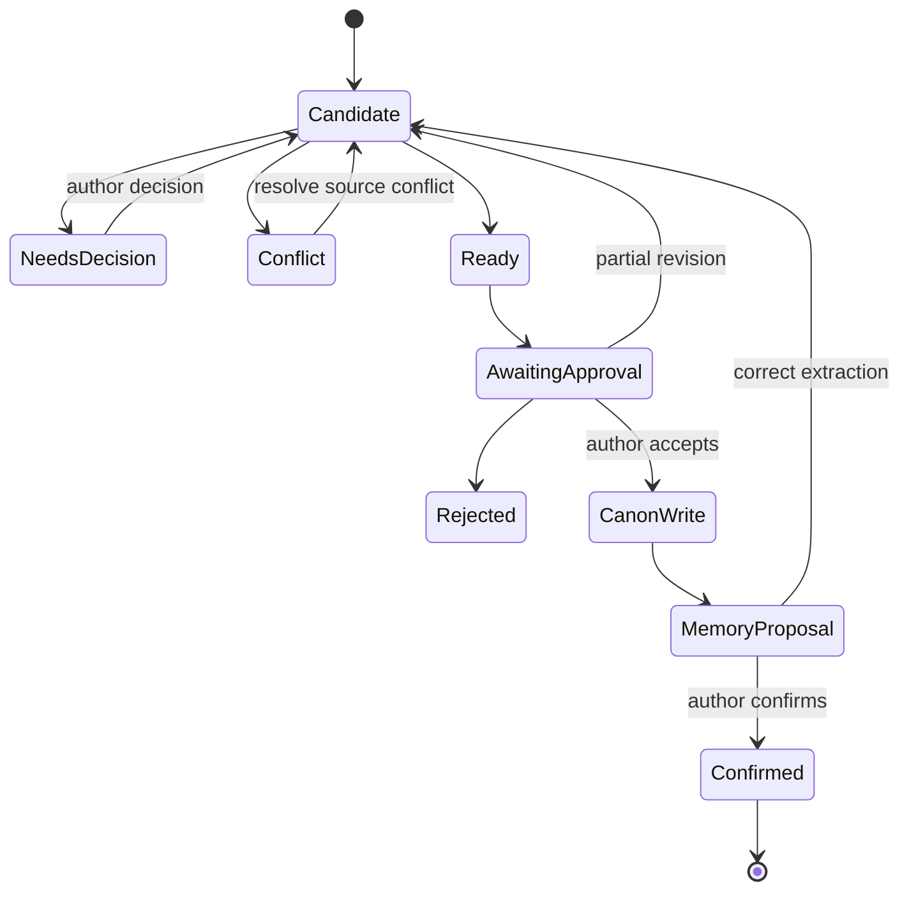

# Tame Ink 最终产品方案

> 状态：最终产品规格，产品代码实施待确认。
> 日期：2026-07-20。
> 研究依据：番茄官方规则与社群资料、高质量作者教程、真实失败案例、本地 150 份有效教材，以及现有 Tame Ink 架构审计。

## 1. 核心结论

Tame Ink 不是“一键写小说”的文本生成器，而是一个面向长篇连载的**人机协作创作操作系统**：

- 作者担任主编，决定写什么、为什么写、人物如何选择、故事向哪里发展，并对最终正文负责。
- AI 担任执行团队，负责研究、枚举、结构化、规划、生成、比较、审稿、事实提取和重复检查。
- 确定性工作流负责状态迁移、来源校验、审批、正式写入和失败停止，AI 无权绕过。

产品目标不是生成最多文字，而是：

> 在不越过作者决策权的前提下，最大化每单位作者决策精力所产出的可发布高质量正文。

产品建设与真实验证分为两个连续阶段：

1. **先跑通产品闭环**：证明每一步可执行、状态正确、来源可追溯、失败会停止、候选不会污染正式作品。
2. **再生产真实内容验证**：使用完成的产品创作一部真实作品，验证正文质量、作者效率、长期一致性和番茄反馈，并据此迭代。

工程验收通过只说明系统可以可靠工作，不等于已经证明作品有商业成绩。

## 2. 产品目标与非目标

### 2.1 P0 目标

- 从一个想法启动新书，不要求先完成全书大纲。
- 把作者决定转换成可执行的读者契约、故事引擎、人物状态和滚动故事卡。
- 在作者确认关键方向后，由 AI 高效生成整章或局部正文候选。
- 对候选提供有正文引用的连续性、期待、人物、场景、对话和认知负担诊断。
- 支持作者逐项接受、拒绝、混合或局部修改，而不是整章二选一。
- 只从作者确认正文中提取实际事件、人物状态和期待兑现。
- 根据作品真实状态自动生成唯一的下一决策或下一执行任务。
- 支持作者进入收尾里程碑、规划契约兑现、完成章节导出和发布前检查。
- 刷新、重启、任务中断和模型失败后，状态仍然一致且可恢复。

### 2.2 P0 不做

- 不承诺签约、收入、爆款或固定追读提升。
- 不预测番茄推荐算法，不伪造后台指标。
- 不自动抓取平台数据，不自动切书。
- 不使用统一商业总分作为正文门禁。
- 不要求固定章数、字数、爽点频率或唯一结构公式。
- 不生成静态几十章详纲作为开书前置。
- 不从套路库随机抽取并拼装核心剧情。
- 不让 AI 自动确认人物关键选择、主线转向和正式事实。
- 不自动重试、切换模型、降级输出或用兜底文本掩盖失败。
- 不在 P0 建设复杂关系画布和多线可视化编辑器。

## 3. 第一性原理

### 3.1 长篇网文的本质

长篇连载不是一次性生成任务，而是连续的状态转换：

`当前状态 + 人物行动 + 环境压力 -> 本轮事件 -> 读者回报 -> 状态变化 -> 下一轮可行动空间`

产品必须管理“前后发生了什么、为什么发生、读者在等什么、人物现在能做什么”，而不只是管理章节文件。

### 3.2 作者最稀缺的是决策精力

作者不应该把时间耗在：

- 重复整理上下文。
- 手工核对人物、时间线和伏笔。
- 在十几个独立工具之间搬运内容。
- 反复向模型解释同一作品。
- 从多个大段候选中寻找微小差异。

产品应把作者注意力集中在少量高价值决策上，并在决策完成后让 AI 批量执行。

### 3.3 高质量必须可追溯

模型说“节奏很好”或“商业性 85 分”没有可验证价值。有效诊断必须包含：

- 引用的正文或正式事实。
- 具体观察。
- 为什么可能是问题。
- 影响哪些承诺、人物或后续计划。
- 可接受、可拒绝的局部修订候选。
- 不确定性和可能反证。

## 4. 完整产品流程

```mermaid
flowchart LR
    A["作者输入创作意图"] --> B["平台与题材证据"]
    B --> C["读者契约候选"]
    C --> D{"作者确认"}
    D -->|拒绝或修改| C
    D -->|确认| E["故事引擎与人物候选"]
    E --> F{"作者确认关键方向"}
    F -->|确认| G["开篇实验或当前滚动故事卡"]
    G --> H{"作者确认故事卡"}
    H -->|确认| I["章节场景执行清单"]
    I --> J{"作者确认关键选择"}
    J -->|确认| K["AI 生成整章或局部候选"]
    K --> L["证据诊断与修订差异"]
    L --> M{"作者审批正文"}
    M -->|拒绝/局部重做| K
    M -->|确认| N["写入正式正文"]
    N --> O["提取实际事件与状态变化"]
    O --> P{"作者确认实际回写"}
    P --> Q["更新故事库与下一任务"]
    Q --> R{"继续连载或进入收尾"}
    R -->|继续连载| G
    R -->|进入收尾| S["契约兑现与完结规划"]
    S --> T["完结审批、导出与发布前检查"]
```

### 4.1 新书启动

输入：作者想写的题材、表达意图、目标平台和已有素材。

AI 执行：

- 整理作者已有信息，明确哪些是事实、偏好和未知。
- 根据目标平台与题材证据提供读者契约候选。
- 比较候选的核心体验、长期可运行性、素材要求和风险。

作者决策：

- 目标读者与题材边界。
- 核心体验和必须兑现的内容。
- 明确不写的内容和个人表达边界。

最小启动条件：`platform`、`genre_scope`、`core_experience`、`protagonist_drive`、`first_story_goal` 和至少一个长期方向。缺失时停止，不生成正文。

### 4.2 读者契约

读者契约不是营销口号，而是书名、简介、开篇和长期正文共同作出的承诺。

最小字段：

- `platform`、`channel`、`genre_scope`
- `target_readers`
- `core_experience`
- `protagonist_promise`
- `must_payoffs[]`
- `forbidden_directions[]`
- `evidence_refs[]`
- `status`

任何故事引擎、开篇和章节审稿都必须引用当前已确认契约。

### 4.3 故事引擎

故事引擎负责回答“这本书为什么能持续产生新故事”。

最小字段：

- `protagonist_role`
- `desire`、`fear`、`value_priority`
- `action_mechanism`
- `world_pressure`
- `conversion_chain`
- `state_dimensions[]`
- `variation_axes[]`
- `long_lines[]`
- `ending_direction`

AI 提供 2-3 个因果完整候选，作者确认核心梗、人物关键动机和长期方向。不能靠随机新敌人、等级膨胀或新增设定补齐长期性。

### 4.4 人物系统

人物不是标签集合。系统保存：

- 外观和社会身份。
- 当前资源与行动权限。
- 欲望、恐惧、信念和价值优先级。
- 对不同人物的关系立场。
- 压力下的决策模式。
- 已确认正文中的选择证据。
- 当前故事中强、中、弱设定的相对作用。

人物变化必须有正文过程。AI 可以提供符合约束的行为候选，但不能为了执行既定剧情而改变人物核心。

### 4.5 开篇实验

开篇不是固定“黄金三章”。系统围绕同一个读者契约生成不同切入候选：

`同一契约 -> A/B 切入 -> 比较承诺落地、主角行动和理解成本 -> 作者选择/混合/全部拒绝 -> 扩展首个完整单元故事`

A/B 是低成本决策工具，不是模型自动选优。开篇通过内部验证的条件是：首个单元能够运行并与后续方向相连，而不是达到固定字数。

### 4.6 滚动故事卡

故事卡是 P0 的核心生产对象，每次只维护当前和少量后续卡片。

最小字段：

- `goal`
- `motivation`
- `expectations[]`
- `hard_constraints[]`
- `soft_plan[]`
- `reaction_targets[]`
- `long_line_contribution[]`
- `cycle_input`
- `cycle_delta`
- `carried_assets[]`
- `next_affordance`
- `actual_events[]`
- `actual_payoffs[]`
- `drift_decision`

硬约束来自正式事实、人物核心、已确认承诺和平台禁区。软计划可以被正文创作改变。正文偏离软计划时，作者选择接受偏差、改回正文或重规划后续。

### 4.7 期待账本

每个期待记录读者正在等待的具体问题，而不是“钩子数量”。

状态：`opened`、`strengthened`、`partially_paid`、`paid`、`invalidated`。

兑现必须在语义上回应原问题。一条期待可以分阶段兑现，一次事件也可以同时回收多条期待并开启新的因果期待。`invalidated` 必须由作者确认原因。

### 4.8 章节规划

章节是发布容器，内部由 `SceneUnit[]` 组成。每个场景记录：

- `entry_state`
- `local_intention`
- `foreground_purpose`
- `required_information[]`
- `action_reaction_chain[]`
- `state_delta`
- `expectation_ops[]`
- `exit_link`

AI 先验证场景是否服务当前故事卡，再生成执行清单。关键人物选择、重大信息揭露和不可逆状态变化必须由作者确认；普通表达、动作组织和过渡由 AI 自主执行。

### 4.9 正文生成

故事卡和关键选择确认后，默认允许 AI 生成整章候选。作者也可以选择：

- 只生成一个场景。
- 只写对话或动作段落。
- 对已有正文续写。
- 对选中范围局部改写。
- 生成两个差异明确的候选。

生成上下文只装配当前任务需要的事实、最近事件、人物状态、未兑现期待、相关原文和已确认风格样本，不直接塞入整部小说。

### 4.10 证据审稿

审稿按需启用以下视角：

- `Continuity`：事实、时间、能力、物品、关系和伏笔冲突。
- `Promise`：读者契约、期待建立、加强、兑现和错位。
- `Character`：选择是否符合欲望、信息、价值、资源和关系。
- `Scene`：场景用途、进入/退出状态和无效重复。
- `Dialogue`：人物议程、信息权限、潜文本、动作/沉默和台词信息搬运。
- `CognitiveLoad`：陌生人物、设定、视角、时间跳转和理解成本。
- `Style`：只对照作者确认样本，不追求统一“网文腔”。

审稿不输出统一总分。确定性冲突阻止正式确认；主观问题只提示，由作者决定。

### 4.11 差异审批

所有 AI 产物先进入候选区。作者可以：

- 全部接受。
- 全部拒绝。
- 按差异块接受。
- 混合多个候选。
- 手工修改后确认。
- 要求只重做指定范围。

系统在确认前展示候选会影响的事实、人物、期待、伏笔和后续卡片。

### 4.12 实际回写

正文确认后，AI 从正式文本提取：

- 实际事件。
- 人物选择和状态变化。
- 新增或改变的关系。
- 已兑现、部分兑现或失效的期待。
- 新事实、物品、能力、时间和地点。
- 计划与实际偏差。

这些内容仍是 `memory_proposal`，作者确认后才进入故事库。候选稿、被拒绝内容和审稿假设不能污染正式记忆。

### 4.13 卡文与重规划

卡文处理流程：

`定位冲突约束 -> 标注来源层级 -> 计算影响范围 -> 给出互斥调整方案 -> 作者选择 -> 只重规划受影响内容`

系统不提供脱离问题的随机灵感。需要改变正式事实、人物核心或读者契约时必须停止；不能通过临时补设定、人物降智或隐藏逻辑推进。

### 4.14 收尾与完结

完结不由固定字数触发，而由作者进入收尾里程碑或全书契约接近兑现触发。

系统生成：

- 全书承诺兑现矩阵。
- 人物最终状态目标。
- 未回收关系和伏笔。
- 可以明确留白的内容。
- 多条长期线共享高潮候选。
- 高潮后的必要回报和新平衡。

收尾阶段不自动开启同等级新主线。

### 4.15 导出、发布与真实验证

P0 提供章节导出和发布前检查，不自动代替作者向平台发布。产品闭环跑通后，使用 Tame Ink 完成真实作品试创作：

1. 完整走完新书启动、故事引擎和开篇实验。
2. 至少完成一个完整单元故事，并连续运行后续滚动故事卡。
3. 由作者对每章做真实取舍和修改，不使用为了测试而预写的答案。
4. 记录作者耗时、决策数、候选接受率、手工重写比例和发现的事实冲突。
5. 作者判断内容达到发布标准后，再进入番茄发布和读者反馈验证。

真实验证结果用于修正题材策略、字段负担、诊断权重和交互，不用于修改已经发生的事实。

## 5. 信息架构

一级导航收敛为四个作品工作域和一个全局设置入口。

### 5.1 工作台

第一屏只展示：

- 当前创作里程碑。
- 最上游的一个待决策问题。
- 下一项可执行任务。
- 当前故事卡进度。
- 明确阻塞原因。
- 最近一次正式写入和可恢复任务。

不展示与正式正文脱节的手工目标、存稿数字和独立待办列表。

### 5.2 创作

统一承载开篇、故事卡、章节和修改：

- 左栏：当前故事卡、期待和场景执行清单。
- 中栏：Tiptap 正文编辑器、候选和差异。
- 右栏：证据诊断、影响范围和审批。

页面不因从开篇进入普通章节而切换到另一套工具。

### 5.3 故事库

包含：

- 读者契约和故事引擎。
- 正式人物状态与选择证据。
- 世界规则、时间线、物品和能力。
- 实际事件。
- 期待和伏笔。
- 素材与对标证据。
- 来源和历史版本。

正式内容、候选内容和观察假设必须有明确视觉区分。

### 5.4 复盘

P0：决策记录、版本历史、任务运行、模型消耗和安全诊断。

P1：在核验番茄官方字段后增加发布数据、异常区间、正文事件对齐、多个原因假设和反证。

### 5.5 设置

保存模型连接、价格、预算和本地工作区设置。模型错误直接失败，不提供隐式供应商切换。

## 6. 核心领域模型

### 6.1 四层事实

1. `canon`：作者确认的设定、正文、事件和状态。
2. `commitment`：作者确认但尚未发生的契约、目标、期待、伏笔和禁区。
3. `candidate`：AI 提议的引擎、计划、正文、修订和记忆。
4. `hypothesis`：研究、数据和审稿中的观察与原因假设。

任何跨层升级都必须有显式作者决定。

### 6.2 核心对象

| 对象 | 用途 | 正式所有者 |
| --- | --- | --- |
| `ReaderContract` | 约束全书读者承诺 | 作者 |
| `StoryEngine` | 定义长期状态转换机制 | 作者 |
| `CharacterState` | 保存人物当前可行动状态和选择证据 | 作者 |
| `Expectation` | 跟踪读者问题与语义兑现 | 作者审批 |
| `StoryCard` | 当前单元的滚动执行计划 | 作者 |
| `SceneUnit` | 当前章节的执行单元 | 关键选择由作者确认 |
| `CandidateArtifact` | 承载所有 AI 候选 | 候选区 |
| `EvidenceFinding` | 承载有引用的诊断 | 观察区 |
| `ActualEvent` | 保存正文真实发生的内容 | 作者 |
| `Decision` | 保存接受、拒绝、混合和重规划 | 作者 |

### 6.3 状态机

Agent 只能产生 `Candidate`、`NeedsDecision` 或 `Conflict`。正式写入由可信工作流执行。

## 7. 人机职责边界

| 工作 | 作者 | AI | 确定性系统 |
| --- | --- | --- | --- |
| 题材与表达方向 | 最终决定 | 研究和比较候选 | 保存决策与来源 |
| 读者契约 | 最终确认 | 草拟、检查一致性 | 阻止未确认契约进入正文流程 |
| 核心梗和故事引擎 | 最终决定 | 枚举并分析长期运行性 | 管理版本和状态 |
| 人物关键选择 | 最终决定 | 给符合约束的动作候选 | 检查正式事实冲突 |
| 滚动故事卡 | 确认目标和硬约束 | 规划软路径和执行细节 | 保存计划/实际偏差 |
| 章节正文 | 审批最终文本 | 默认生成整章或局部候选 | 管理草稿、差异和正式写入 |
| 审稿 | 决定是否修改 | 给引用、原因和修订候选 | 只让确定性问题成为硬门禁 |
| 记忆回写 | 确认提取结果 | 从正式正文提取 | 保证候选不能污染 canon |
| 数据复盘 | 决定调整、观察或停止 | 提出多个假设与反证 | 保存指标定义和时间版本 |

## 8. Agent 与 Skill 架构

### 8.1 确定性编排

工作流代码决定调用顺序、允许工具、上下文清单、Schema、停止条件和正式写入。Agent 不拥有 Shell、任意网络和作品写权限。

### 8.2 Agent 职责

- `Researcher`：平台、题材和对标证据。
- `StoryEditor`：读者契约、故事引擎和滚动故事卡候选。
- `ChapterPlanner`：把已确认故事卡转换为场景执行清单。
- `DraftWriter`：执行整章、场景、对话和局部改写。
- `ContinuityAuditor`：正式事实和因果冲突。
- `PromiseAuditor`：契约、期待与兑现。
- `SceneAuditor`：人物选择、场景用途和对话行动。
- `CognitiveLoadAuditor`：信息、视角和理解成本。
- `MemoryCurator`：从确认正文提取实际状态。

### 8.3 P0 Skill

- `webnovel-studio`
- `webnovel-research-genre`
- `webnovel-design-reader-contract`
- `webnovel-design-story-engine`
- `webnovel-plan-rolling-story`
- `webnovel-plan-chapter`
- `webnovel-draft`
- `webnovel-audit`
- `webnovel-curate-memory`
- `webnovel-plan-ending`

P1 在取得真实发布数据后增加 `webnovel-review-serialization`。

每次只触发一个主 Skill。所有 Skill 返回：

- `status`: `ready`、`needs_decision` 或 `conflict`
- `source_refs[]`
- `evidence[]`
- `candidate`
- `decision_requests[]`
- `effects[]`

对话、七步法、ABC、三幕式和故事卡词典属于按条件加载的参考方法，不各自成为顶层 Skill。

## 9. 上下文与长期记忆

### 9.1 上下文装配

每个任务只读取：

- 当前已确认契约和故事卡。
- 当前章节需要的正式事实。
- 相关人物状态和关系。
- 最近实际事件。
- 未兑现期待和关联伏笔。
- 必要原文引用。
- 作者确认的风格样本。

上下文编译器记录来源、字符预算、检索词和截断结果。缺少必要来源时失败，不让模型凭记忆补全。

### 9.2 记忆结构

- Markdown/YAML 保存可读、可版本化的正式作品内容。
- SQLite 保存任务、事件、审批、索引和运行状态。
- Git/Dulwich 保存正式版本和回滚点。
- FTS 负责正文和事实检索。
- 摘要可以重建，不能成为唯一事实来源。

SQLite 和 Markdown 不能分别维护同一正式事实。SQLite 保存索引和状态，正式语义以作者确认的 canon 文件为准。

## 10. 效率设计

- **唯一下一任务**：系统根据作品状态生成，不让作者维护另一套待办。
- **渐进披露**：新人只看到当前必须决定的字段，复杂理论按问题展开。
- **决策后批量执行**：方向一旦确认，AI 可完成规划、整章生成、审稿和事实提取。
- **只在关键分叉生成多个候选**：普通执行不浪费作者比较成本。
- **局部重生成**：允许只重做失败的场景或对话，不重复整章。
- **差异审批**：作者直接处理变化，不反复阅读完整候选。
- **计划/实际闭环**：正文写完立即更新后续，不让大纲与作品长期分叉。
- **失败即停**：不让错误继续扩散到下一章。

## 11. 质量与失败规则

### 11.1 硬门禁

- Schema 非法。
- 必要来源缺失。
- 正式事实互相冲突。
- 关键作者决策未确认。
- 新规则或人物变化没有授权。
- 明确平台合规问题。
- 候选试图直接写入 canon。

### 11.2 软诊断

- 节奏快慢。
- 爽感强弱。
- 对话张力。
- 场景是否值得保留。
- 风格偏差。
- 题材差异化。
- 期待强度。

软诊断必须有证据，但不能阻止作者确认。

### 11.3 禁止兜底

- 不自动补世界规则。
- 不把人物降智解释为剧情需要。
- 不用新敌人掩盖故事引擎失效。
- 不用随机模板填补卡文。
- 不在模型失败后返回看似成功的空产物。
- 不因数据不足自动归因或切书。

## 12. 产品完成后的真实内容验证

### 12.1 阶段 A：工程闭环验证

目标：证明流程可靠。

- 所有状态可进入、可退出、可恢复。
- 候选无法直接进入正式事实。
- 每个诊断都有来源。
- 所有关键方向都有作者审批。
- 模型或 Schema 失败不会生成替代内容。
- 两类相反题材 fixture 均不会被套用同一公式。

### 12.2 阶段 B：真实创作验证

目标：用产品生成真实、连续、作者愿意修改和发布的内容。

至少完整运行：

- 一次新书启动和读者契约确认。
- 一套故事引擎。
- 一次开篇实验。
- 一个完整单元故事。
- 多张连续滚动故事卡。
- 每章生成、审稿、审批和实际回写。
- 一次真实卡文或计划偏差处理。

过程指标：

- 作者每章决策耗时。
- 从确认故事卡到候选正文的耗时。
- 候选接受、局部接受和全部拒绝比例。
- 作者手工重写比例。
- 审稿发现并被作者确认的问题数量。
- 正式事实冲突和错误记忆数量。
- 后续卡片因实际正文需要重规划的比例。
- 作者主观判断“AI 是否节省精力”。

这些指标用于发现产品负担和 AI 执行问题，不设成通用质量阈值。

### 12.3 阶段 C：真实平台验证

作者确认内容达到发布标准后，在番茄真实发布。只使用官方可见且已核验定义的指标，记录版本、日期和样本范围。

分析流程：

`平台数据 -> 定位异常区间 -> 对齐正文事件与当时承诺 -> 提出多个原因假设和反证 -> 作者决定继续观察、局部修改或调整后续`

不把单次结果当算法规律，不自动修改已发布正文，不自动决定切书。

## 13. 版本规划

### P0：完整创作闭环

- 四层事实和核心领域对象。
- 十个 P0 Skill。
- 新书启动、故事引擎、开篇和滚动故事卡。
- 章节规划、生成、审稿、差异审批和实际回写。
- 收尾兑现矩阵、完结规划、章节导出和发布前检查。
- 工作台、创作、故事库、复盘四域。
- 固定案例、迁移、恢复和失败测试。

### Alpha：真实内容生产

- 使用 P0 创建真实作品。
- 根据作者决策成本和正文问题修正交互、字段和提示。
- 只修复能由真实内容证据说明的问题。

### P1：连载复盘与长期能力

- 番茄官方规则与指标版本库。
- 手工数据录入和 CSV 导入。
- 异常区间与正文事件对齐。
- 完结规划。
- 多长期线和跨卡依赖视图。
- 作者成熟度和诊断深度配置。

### P2：个性化与高级能力

- 从作者接受、拒绝和手工修改中提炼个人偏好候选。
- 高级多线可视化。
- 更多平台适配。
- 经过明确收益验证后再评估任务级模型选择。

## 14. 对现有产品的改造

### 14.1 保留

- 本地优先架构。
- Markdown/YAML、SQLite 和 Git 版本。
- 原子审批和候选/正式隔离。
- 受控 Agent、单进程 worker 和无隐式重试。
- Tiptap、`prosemirror-changeset` 和现有三栏编辑能力。
- 分层摘要、FTS、任务事件和脱敏诊断。

### 14.2 重构

- `AppShell.tsx`：约 16 个平级入口收敛为四域。
- `TodayWorkspacePage.tsx`：改为服务器生成的下一决策和下一执行。
- `ChapterPage.tsx`：改为故事卡到实际回写的连续界面。
- `backend/app/agents/schemas.py`：新增核心对象和公共 Skill 契约。
- `backend/app/workflows/new_book.py`：改为最小启动和作者决策门。
- `backend/app/workflows/chapter.py`：移除商业总分门禁，增加故事卡、场景、审批和偏差闭环。
- `backend/app/workflows/memory.py`：只从确认正文生成待审批实际回写。
- `backend/app/agents/subagents.py`：重设 Agent 职责和决策边界。
- `skills/webnovel-*`：按任务重组，不再按零散理论堆叠。
- `evaluations/`：从商业打分转向状态、引用、停止和反例评测。

### 14.3 移除或降级

- 商业总分硬门禁。
- 固定 `2500-3500` 字质量规则。
- 默认七步法。
- 全书/前 50 章强制规划。
- 独立黄金三章、套路和批量规划一级页面。
- `localStorage` 中的业务真相。

## 15. 开源复用决策

P0 不新增核心依赖。现有技术已覆盖编辑器、差异、状态、队列、存储、检索和版本控制。

- P1 若确认需要拖拽排序，优先评估 `dnd-kit`。
- P2 若确认需要关系图，评估 React Flow。
- 不引入新的通用 Agent 框架包裹现有受控 DeepAgent。
- 不自行实现编辑器 diff、拖拽和图布局等已有成熟能力。

## 16. 实施计划

跨文件实现必须在用户确认后逐步进行。

| 步骤 | 内容 | 影响范围 | 验证 |
| --- | --- | --- | --- |
| 1 | 建立四层事实、核心对象、状态机和迁移 | backend schemas/domain/repositories/tests | 后端契约、仓储、迁移、ruff、mypy |
| 2 | 重构十个 P0 Skill、Agent 和上下文 | skills、agents、evaluations | Skill 校验、agent tests、fixture evaluate |
| 3 | 实现启动、故事卡、章节、审批、回写、收尾、导出和下一任务 API | workflows、API、task state | workflow/API tests 和故障注入 |
| 4 | 收敛四域导航和服务器工作台 | AppShell、TodayWorkspace、router、client | frontend tests、lint、build |
| 5 | 重做连续创作、诊断、差异审批、故事库和收尾导出界面 | ChapterPage、editor、story/memory/completion pages、E2E | 组件测试和 Playwright 全流程 |
| 6 | 完成迁移、固定案例、恢复、脱敏和全量验收 | README、fixtures、跨端测试 | `make verify`；显式 live 测试只验结构与行为 |

最容易出错的地方：

- 旧作品迁移时产生 SQLite 与 Markdown 双真相。
- 候选、观察假设或未审批记忆进入 canon。
- 前后端把主观诊断重新实现成硬门禁。
- 任务重启后重复确认或重复写入。
- 部分差异接受导致正文位置错乱。
- Skill 触发范围过宽，一次加载多套互相冲突的方法。
- 固定案例通过被错误宣传为真实市场有效。

## 17. 完成定义

P0 完成必须同时满足：

1. 新项目可以从创作意图一路走到确认正文、实际回写、收尾规划和导出。
2. 作者在每个关键方向上拥有显式决定权。
3. AI 在确认范围内能够默认完成整章执行。
4. 所有诊断有可定位证据，且无统一商业总分。
5. 正式事实、承诺、候选和假设无法静默串层。
6. 卡文、事实冲突、模型失败和任务中断都有明确停止或恢复行为。
7. 刷新和重启后工作台给出同一个下一任务。
8. 旧项目可以打开、迁移和回滚。
9. `make verify` 通过。
10. 完成后立即进入真实内容生产验证，而不是继续扩充理论功能。

这份方案的最终执行原则是：**先把完整创作系统做成，再用它真正写书；用真实写出来的内容发现问题，用真实问题决定下一轮开发。**
